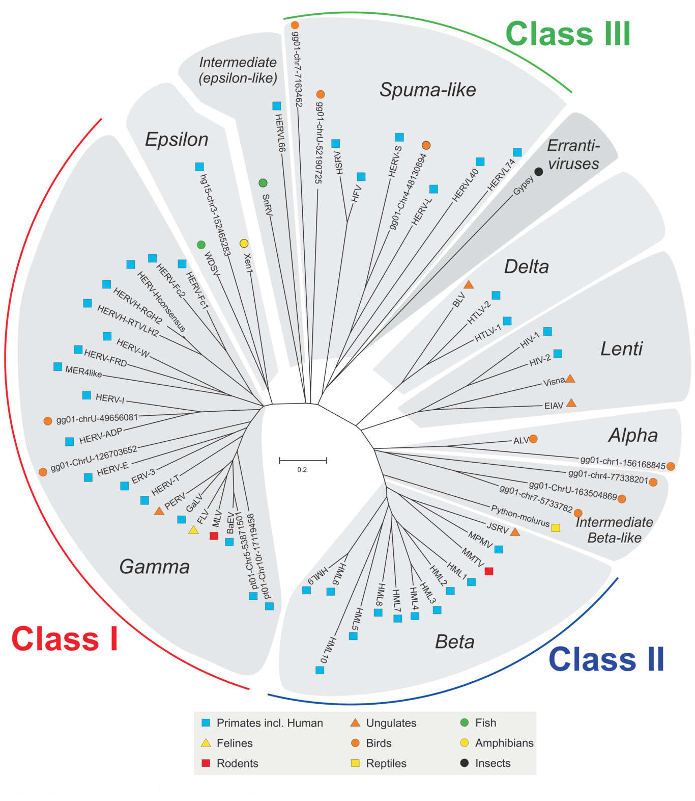

# Overview of article "Improved Integration Time Estimation of Endogenous Retroviruses with Phylogenetic Data"

***

## Table of Content
* [Links](#links)
* [Glossary](#glossary)
* [Discussion](#discussion)
* [Distance Methods](#distance-methods)
* [Extra](#extra)
	+ [Found ERVs by far](#found-ervs)
	+ [HOWTO RetroTector](#using-retrotector)
    + [Results](#results)

***

### Links
* [Link to the article][Article link] :: [Article local copy][Article local]
* [Gypsy][GYDB LTR] - База данных ретроэлементов
* [RetroTector][RT] :: [#howtouse](#using-retrotector)

***

### Glossary
* **LTR** -- [_Long Terminal Repeat_][LTR] -- [**Длинные концевые повторы**][LTR_ru]
	+ Структура _LTR_`а:
		- Обычно начинается с `5'TG-...` (или на `CCTAA`)
		- _U3_ регион длины 200-1200 nt, содержащий зону промоутеров
		- Повторяющийся регион _R_
		- _U5_ регион длины 75-250 nt, являющийся началом ретротранскрибированного (_retrotranscribed_) генома
		- Обычно заканчивается `...CA-3'` (или на `CCTAA`)
	+ Структура ретроэлемента:
		- `5'LTR - PBS - Retrotransposone - PPT - 3'LTR`
		- `5' TG [U3 R U5> CA <PBS] Retrotransposone [PPT> TG [U3 R U5> AC 3'`
		- ![LTR structure][]
	+ **PBS** -- _Primer Binding Site_ -- последовательность длины 18 nt, комплементарная специфичной зоне 3' конца тРНК, и использующаяся как праймер для обратной транскриптазы для синтеза ДНК(-) цепочки, комплементарной _R-U5_ зоне _5'LTR_'а
	+ **PPT** -- _Polypurine Tract_ -- последовательность из 10 A/G, ответственная за начало синтеза ДНК(+) цепочки
	+ [**LTR process Interactive**][LTR process]

* **ERV**s -- [_Endogenous retroviruses_][ERV] -- **Эндо-ретровирусы**

  **Retroviridae** -- **[Ретровирусы][RV_ru]**
    + Ретровирусы можно идентифицировать по последовательности:
      `5'LTR, pbs, gag, pol, env, 3'LTR`
	  ![RV][]
        - **pbs** -- _primer binding site_ -- Сайт связывания праймера
        - **gag** -- _group-specific antigens_ -- Специфичные антигены группы
        - **pol** -- _polymerase_ -- Ревертаза (Обратная транскриптаза)
        - **env** -- _envelope_ -- белки оболочки & белки репродукции
	+ Главное отличие от типичных ретроэлементов -- наличие _env_ гена:
	  ![LTR autonomous][]
	+ Классы эндо-ретровирусов:
	   <a href="assets/ERVclasses.png"></img></a>

* **TSD** -- _Target Site Duplications_ -- duplicated genomic sequences resulting from the mechanism of integration
	![LTR and TIR][]

* **paralog**
    + Гомология вследствие **дупликации гена** в пределах одного организма

* **loci** -- Витальный (вирусный) локус
    + Местоположение вируса

* **Integration time** -- **Время встраивания**
    + Время от момента встраивания вируса в геном
    + Оценка по формуле:
      **`IntegrationTime = Distance(5'LTR, 3'LTR) / (rate_5' + rate_3')`**
    + **Distance(5', 3')** -- генетическое расстояние между 5' и 3' _LTR_'ами. В статье вычисляется в MEGA по методу _Maximum Composite Likelihood_. Размерность вроде как \[замен/сайт\].
    + **rate** -- скорость "эволюции" каждого _LTR_'а (5' и 3') в отдельности. Грубая оценка для млекопитающих ~= 2.2e-9 замен/сайт/млн лет.
    + ~~Ещё можно вывести такую формулу:~~
      ~~`T2 = T1 * 2*d3 / (d1+d2)`~~
        - ~~**T1** -- _Known speciation time_~~
        - ~~**T2** -- _Integration Time_~~
        - ~~**d1** -- `Distance(5'h, 5'm) = T1 * 2*rate_5'`~~
        - ~~**d2** -- `Distance(3'h, 3'm) = T1 * 2*rate_3'`~~
        - ~~**d3** -- `Distance(5'h, 3'h) = T2 * (rate_5' + rate_3')`~~

* **MYA** -- _Millions Years Ago_ -- **Миллионов лет назад**
    + Единица измерения времени встраивания

* **MCMC** -- [_Marcov chain Monte Carlo_][MCMC] -- **Методы Монте-Карло в Марковских цепях**
    + Марковская модель даёт на выходе оценку (интервал) времени встраивания
    + 8 из 10 точечных оценок в статье (полученных от базовых филогенетических методов) лежали внутри полученных от MCMC интервалов
    + В работе были использованы 4 расчётных скорости эволюции (_estimated rates of evolution_) и 2 интервала скоростей (_rates_) для человеческих эндо-ретровирусов из литературы; произведены расчёты времени встраивания (_Table 2_); всё это проверено на соответсвие результатам MCMC

* **Molecular clock** -- [_gene clock, evolutionary clock_][MC] -- [**Молекулярные часы**][MC_ru]
    + Метод датирования филогенетических событий (расхождений и др.)
    + Основан на гипотезе _molecular clock hypothesis_, согласно которой эволюционно значимые замены мономеров в нуклеиновых кислотах или аминокислот в белках происходят с практически постоянной скоростью

* **HKY** & **GTR** -- _Hasegawa-Kishino-Yano_ & _General Time Reversible_ -- [**Модели замен**][SM_ru]
    + _HKY_: модель позволяет одновременно использовать дополнительные параметры, введенные в моделях Фельштейна и Кимуры. Частоты нуклеотидов могут различаться, вероятность замен различна для транзиций и трансверсий
    + _GTR_: наиболее сложная модель. Использует различные частоты нуклеотидов (4 параметра), и различные частоты замен между нуклеотидами (6 параметров)
    + В работе показано существенное различие скоростей замен (_substitution rates_) у разных семейств эндо-ретровирусов. В качестве приблизительной даты разделения "обезьян Нового и Старого Света" было использовано время встраивания в _25 MYA_ (млн. лет назад).

* **Taxon** -- [Таксон][Taxon_ru]
    + Группа из объектов, объединяемых на основании общих свойств и признаков

* **OTU** -- _Operational taxonomic unit_

* **NT** -- _**n**ucleo**t**ide_
	+ Единица измерения длин одноцепочечных ДНК/РНК

***

### Discussion
(Перевод соответствующей части статьи)

Ясно, что использование одной и той же скорости (_rate_) для всей последовательности эндо-ретровируса для расчётов времени встраивания ведёт к упущениям некоторых важных факторов.

Конечная оценка сильно зависит от изначального предположения, насколько быстро эволюционирует эндо-ретровирусная последовательность.

Также ясно, что 5' и 3' концы _LTR_'ов имеют разные эволюционные скорости -- 3' концы имеют скорости выше, чем 5'.

В работах Zanotto время интеграции семейства эндо-ретровирусов ERV-K оценивается в 18.3 млн. лет. Эта оценка была сокращена до 7.8 млн. лет при рассмотрении ERV-K, содержащихся только в человеческом геноме. Последний результат согласуется с результатами, полученными в работе -- о изученных локусах ERV-K группы: ERV-K2 и ERV-K7. Однако, другие локусы ERV-K группы наследованы от более далёких предков, например ERV-K3 и ERV-K9.

Такие сильные различия в полученных временах встраивания и эволюционных скоростях группы эндо-ретровирусов ERV-K препятствуют широкому обобщению их свойств.

***

### Distance Methods
* Оригинал: [link][DM link]
* **Методы оценки расстояний** пытаются оценить среднее число замен на сайт (_changes per site_) между двумя последовательностями, которые когда-то эволюционно разделились
* Простой подсчёт количества отличающихся сайтов (**p-distance = n / N**) может "недооценить" различие -- особенно в случае очень непохожих последовательностей -- из-за т.н. _multiple hits_ (В ходе эволюции могли произойти замены _A -> T -> G_ -- но мы неправильно посчитаем такой случай только как 1 замену)
* ![DM multihits][]
* Некоторые распространённые модели эволюций последовательностей, широко используемые в "анализе расстояний" (_distance analysis_):
    + **J&C** :: Jukes & Cantor model
        - Предполагает равновероятные изменений
    + **GTR** :: General time reversable model
        - Есть возможность назначений различных вероятностей каждому типу замен
    + **LogDet** :: Paralinear distance model
        - Учитывает неравномерное распределение нуклеотидов в последовательностях
    + Все эти модели учитывают возможные множественные замены одного сайта
    + J&C и GTR могут модифицированны _to include a gamma correction for site rate heterogeneity_ (~~господи, как сложна~~)
    + ![DM gamma][]
* **Jukes & Cantor**
    + **`d_xy = -(3/4) * ln(1 - 4/3*D)`**
    + `d_xy` -- расстояние между последовательностями _x_ и _y_ [замен/сайт]
    + `D` -- наблюдаемая пропорция различающихся нуклеотидов (_p-distance_)
    + `ln` -- натуральный логарифм
    + `3/4` и `4/3` -- коэффициенты отражают наличие 4 типов нуклеотидов и 3 способов отличаться одному нуклеотиду от другого. При этом предполагается, что все замены равновероятны (по 25%, включая "не-изменение")
* **LogDet/Paralinear Distances**
    + **`d_xy = - ln(det F_xy)`**
    + `d_xy` -- расстояние между последовательностями _x_ и _y_ [замен/сайт]
    + `F_xy` -- 4x4 "матрица различий" (_divergence matrix_) для последовательностей _x_ и _y_ -- матрица из пропорций попарных совпадений нуклеотидов.
    + `ln` -- натуральный логарифм
    + `det` -- детерминант матрицы
    + ![DM LogDet][]
    + Магическим образом, это работает гораздо лучше остальных методов

***

### Extra
##### Found ERVs
 + Кажется, [ERV3-1 где-то здесь][ERV3-1].
 + [ERV3-1 RefSeq][]
 + [ERVFRD-1 RefSeq][]

***

##### Using RetroTector
1. Исследуемую последовательность помещаем в файл (в fasta-заголовке лучше указывать только наименование), заливаем на [сайт][RT]
2. Идём во вкладку "[View Results][RTresults]" слева. Созданная работа должна там появиться и начать выполняться. Вся инфа по ней - в столбике "Job"
3. В файле `RetroVID_...`, по-видимому, хранятся найденные одиночные и парные _LTR_'ы (_3LTR_ и _5LTR_). Нам нужны заведомо парные. Берём индексы `first` и `second` для каждого _LTR_'а и достаём их последовательности из исходной.
99. ~~PROFIT~~

***

##### Somewhat called "results"
* В статье есть позиции всех исследованных эндо-ретровирусов (вида `ERV3 [NT_007933.15; Chr7:64,450,201-64,460,983]`), но пока что удалось найти и пощупать на сайте UCSC только [ERV3-1][ERV3-1].
* Достаём ДНК с области вокруг обозначенного гена (`chr7:64,990,000-65,040,000`) и оправляемся на сайт [RetroTector][RT]'а. ([fasta файл с ДНК][ERV3-1 sequence])
* Среди результатов _RetroTector_'а находим файл [RetroVID][ERV3-1 RetroVID]. Ищем какую-нибудь пару _LTR_'ов, берём индексы их интервалов (`first` и `second` поля) и достаём по ним [последовательности повторов][ERV3-1 LTRs] из основной днк.
* ~~Если пар _LTR_'ов не нашлось, то всё плохо~~
* Можно заметить, что оба _LTR_'а начинаются на TG и оканчиваются на CA, как и должно быть.
* Расчёт времени встраивания в _MEGA7_
    + **`IT = D(5', 3') / (rate_5' + rate_3')`**
    + `D(5', 3')` -- Эволюционное расстояние между _5'LTR_ и _3'LTR_
    + После открытия данных (Data->Open), MEGA предложит сделать выравнивание последовательностей. Автоматическое выравнивание -- не совсем то, что нам нужно, поэтому воспользуемся встроенным методом _(Alignment -> Align by ClustalW)_. _"Gap opening penalty"_ увеличиваем до 100 (нас интересует выравнивание преимущественно без _indel_'ов)
    + _Data -> Phylogenetics Analysis_
    + Определяем эволюционное расстояние _(Distance -> Compute Pairwise Distances)_ _(Model/Method: Maximum Composite Likilihood; Uniform rates; Same (Homogeneous))_
    + Для ERV3-1 у человека -- `D(5', 3') = `**`0.094`**. (51 замена из 592 nt)
    + Изначально предположим, что скорости изменчивости обоих _LTR_'ов равны. Грубая оценка этой скорости для всех млекопитающих: **2.2e-9** замены/сайт/год
    + `IT = 0.094 / (2 * 2.2e-9) = `**`21.36`**` млн. лет`
    ___
    + **TODO**: С помощью филогенетического анализа, необходимо оценить скорости эволюции 5' и 3' _LTR_'ов для каждого эндо-ретровируса

[Article link]: http://journals.plos.org/plosone/article?id=10.1371/journal.pone.0014745
[Article local]: journal.pone.0014745.pdf
[GYDB LTR]: http://gydb.org/index.php/LTR_retroelements
[RT]: http://retrotector.neuro.uu.se/pub/queue.php?show=submit
[RT results]: http://retrotector.neuro.uu.se/pub/queue.php?show=queue&js=on&sort=started&filter=all
[ERV]: https://en.wikipedia.org/wiki/Endogenous_retrovirus
[RV_ru]: https://ru.wikipedia.org/wiki/Ретровирусы
[LTR]: https://en.wikipedia.org/wiki/Long_terminal_repeat
[LTR_ru]: https://ru.wikipedia.org/wiki/Длинные_концевые_повторы
[LTR structure]: assets/LTRstructure.gif
[LTR autonomous]: assets/LTRautonomous.jpg
[LTR process]: http://gydb.org/index.php/Ltr_process
[RV]: assets/Retroviridae.gif
[MCMC]: https://en.wikipedia.org/wiki/Markov_chain_Monte_Carlo
[MC]: https://en.wikipedia.org/wiki/Molecular_clock
[MC_ru]: https://ru.wikipedia.org/wiki/Молекулярные_часы
[SM_ru]: https://ru.wikipedia.org/wiki/Модель_замен
[Taxon_ru]: https://en.wikipedia.org/wiki/Taxon
[LTR and TIR]: assets/LTRandTIR.png
[DM link]: http://www.ch.embnet.org/CoursEMBnet/PHYL03/Slides/Distance_membley.pdf
[DM multihits]: assets/DistanceMethods_multihits.png
[DM gamma]: assets/DistanceMethods_gamma-distribution.png
[DM LogDet]: assets/DistanceMethods_LogDet_example.png
[ERV3-1]: http://genome.ucsc.edu/cgi-bin/hgTracks?db=hg38&lastVirtModeType=default&lastVirtModeExtraState=&virtModeType=default&virtMode=0&nonVirtPosition=&position=chr7%3A64990000-65039999&hgsid=530055471_QROmlPcrCiczZaAaMjUsdx33Hu0P
[ERV3-1 RefSeq]: http://genome.ucsc.edu/cgi-bin/hgc?hgsid=530055471_QROmlPcrCiczZaAaMjUsdx33Hu0P&c=chr7&l=64960294&r=65037226&o=64990354&t=65006746&g=refGene&i=NM_001007253
[ERV3-1 sequece]: seqs/seqERV3-1_neighborhood.fasta
[ERV3-1 RetroVID]: res/ERV3-1_RetroVID.txt
[ERV3-1 LTRs]: res/ERV3-1_LTRs.fasta
[ERV3-1 LTRs aligned]: res/ERV3-1_LTRs_aligned.fasta
[ERVFRD-1 RefSeq]: http://genome.ucsc.edu/cgi-bin/hgc?c=chr6&l=11102721&r=11111959&o=11102488&t=11111838&g=refGene&i=NM_207582&db=hg38
