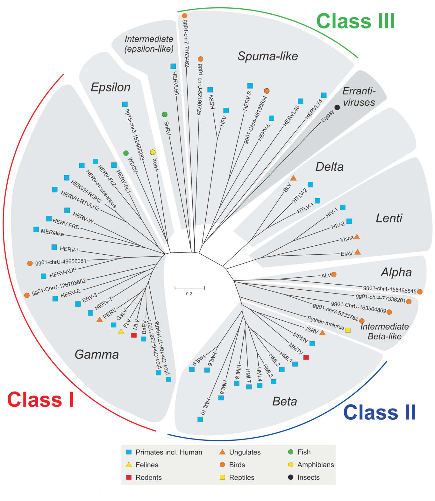

# Overview of article "Improved Integration Time Estimation of Endogenous Retroviruses with Phylogenetic Data"

## Table of Content
* [Links](#links)
* [Glossary](#glossary)
* [Discussion](#discussion)
* [Extra](#extra)
	+ [Found ERVs by far](#found-ervs)
	+ [HOWTO RetroTector](#using-retrotector)

### Links
* [Link to the article][Article]
* [Gypsy][GYDB_LTR] - База данных ретроэлементов
* [RetroTector][RT] :: [#howtouse](#using-retrotector)

### Glossary
* **LTR** -- [_Long Terminal Repeat_][LTR] -- [**Длинные концевые повторы**][LTR_ru]
	+ Структура _LTR_`а:
		- Обычно начинается с `5'TG-...`
		- _U3_ регион длины 200-1200 nt, содержащий зону промоутеров
		- Повторяющийся регион _R_
		- _U5_ регион длины 75-250 nt, являющийся началом ретротранскрибированного (_retrotranscribed_) генома
		- Обычно заканчивается `...CA-3'`
	+ Структура ретроэлемента:
		- `5'LTR - PBS - Retrotransposone - PPT - 3'LTR`
		- `5' TG [U3 R U5> CA <PBS] Retrotransposone [PPT> TG [U3 R U5> AC 3'`
		- ![LTRstructure][]
	+ **PBS** -- _Primer Binding Site_ -- последовательность длины 18 nt, комплементарная специфичной зоне 3' конца тРНК, и использующаяся как праймер для обратной транскриптазы для синтеза ДНК(-) цепочки, комплементарной _R-U5_ зоне _5'LTR_'а
	+ **PPT** -- _Polypurine Tract_ -- последовательность из 10 A/G, ответственная за начало синтеза ДНК(+) цепочки
	+ [**LTR process Interactive**][LTRprocess]

* **ERV**s -- [_Endogenous retroviruses_][ERV] -- **Эндо-ретровирусы**
  **Retroviridae** -- **[Ретровирусы][RV_ru]**
    + Ретровирусы можно идентифицировать по последовательности:
      `5'LTR, pbs, gag, pol, env, 3'LTR`
	  ![RV][]
        - **pbs** -- _primer binding site_ -- Сайт связывания праймера
        - **gag** -- _group-specific antigens_ -- Специфичные антигены группы
        - **pol** -- _polymerase_ -- Ревертаза (Обратная транскриптаза)
        - **env** -- _envelope_ -- белки оболочки & белки репродукции
	+ Главное отличие от типичных ретроэлементов -- наличие _env_ гена:
	  ![LTRautonomous][]
	+ Классы эндо-ретровирусов:
	   <a href="ERVclasses.png"></img></a>

* **TSD** -- _Target Site Duplications_ -- duplicated genomic sequences resulting from the mechanism of integration
	![LTRandTIR][]

* **paralog**
    + Гомология вследствие **дупликации гена** в пределах одного организма

* **loci** -- Витальный (вирусный) локус
    + Местоположение вируса

* **Integration time** -- **Время встраивания**
    + Время от момента встраивания вируса в геном
    + Оценка по формуле:
      `IntegrationTime = Distance(5'LTR, 3'LTR) / (rate_5' + rate_3')`
    + // Ещё можно вывести такую формулу:
      `T2 = T1 * 2*d3 / (d1+d2)`
        - **T1** -- _Known speciation time_
        - **T2** -- _Integration Time_
        - **d1** -- `Distance(5'h, 5'm) = T1 * 2*rate_5'`
        - **d2** -- `Distance(3'h, 3'm) = T1 * 2*rate_3'`
        - **d3** -- `Distance(5'h, 3'h) = T2 * (rate_5' + rate_3')`

* **MYA** -- _Millions Years Ago_ -- **Миллионов лет назад**
    + Единица измерения времени встраивания

* **MCMC** -- [_Marcov chain Monte Carlo_][MCMC] -- **Методы Монте-Карло в Марковских цепях**
    + Марковская модель даёт на выходе оценку (интервал) времени встраивания
    + 8 из 10 точечных оценок в статье (полученных от базовых филогенетических методов) лежали внутри полученных от MCMC интервалов
    + В работе были использованы 4 расчётных скорости эволюции (_estimated rates of evolution_) и 2 интервала скоростей (_rates_) для человеческих эндо-ретровирусов из литературы; произведены расчёты времени встраивания (_Table 2_); всё это проверено на соответсвие результатам MCMC

* **Molecular clock** -- [_gene clock, evolutionary clock_][MC] -- [**Молекулярные часы**][MC_ru]
    + Метод датирования филогенетических событий (расхождений и др.)
    + Основан на гипотезе _molecular clock hypothesis_, согласно которой эволюционно значимые замены мономеров в нуклеиновых кислотах или аминокислот в белках происходят с практически постоянной скоростью

* **HKY** & **GTR** -- _Hasegawa-Kishino-Yano_ & _General Time Reversible_ -- [**Модели замен**][SM_ru]
    + _HKY_: модель позволяет одновременно использовать дополнительные параметры, введенные в моделях Фельштейна и Кимуры. Частоты нуклеотидов могут различаться, вероятность замен различна для транзиций и трансверсий
    + _GTR_: наиболее сложная модель. Использует различные частоты нуклеотидов (4 параметра), и различные частоты замен между нуклеотидами (6 параметров)
    + В работе показано существенное различие скоростей замен (_substitution rates_) у разных семейств эндо-ретровирусов. В качестве приблизительной даты разделения "обезьян Нового и Старого Света" было использовано время встраивания в _25 MYA_ (млн. лет назад).

* **Taxon** -- [Таксон][Taxon_ru]
    + Группа из объектов, объединяемых на основании общих свойств и признаков

* **NT** -- _**n**ucleo**t**ide_
	+ Единица измерения длин одноцепочечных ДНК/РНК

### Discussion
Ясно, что использование одной и той же скорости (_rate_) для всей последовательности эндо-ретровируса для расчётов времени встраивания ведёт к упущениям некоторых важных факторов.
Конечная оценка сильно зависит от изначального предположения, насколько быстро эволюционирует эндо-ретровирусная последовательность.
Также ясно, что 5' и 3' концы LTR\`ов имеют разные эволюционные скорости -- 3' концы имеют скорости выше, чем 5'.
В работах Zanotto время интеграции семейства эндо-ретровирусов ERV-K оценивается в 18.3 млн. лет. Эта оценка была сокращена до 7.8 млн. лет при рассмотрении ERV-K, содержащихся только в человеческом геноме. Последний результат согласуется с результатами, полученными в работе -- о изученных локусах ERV-K группы: ERV-K2 и ERV-K7. Однако, другие локусы ERV-K группы наследованы от более далёких предков, например ERV-K3 и ERV-K9.
Такие сильные различия в полученных временах встраивания и эволюционных скоростях группы эндо-ретровирусов ERV-K препятствуют широкому обобщению их свойств.

### Extra
##### Found ERVs
 + Кажется, [ERV3-1 где-то здесь][ERV3-1].
 + [RefSeq ERV3-1][]
 + [RefSeq ERVFRD-1][]

##### Using RetroTector
1. Исследуемую последовательность помещаем в файл (в fasta-заголовке лучше указывать только наименование), заливаем на [сайт][RT]
2. Идём во вкладку "[View Results][RTresults]" слева. Созданная работа должна там появиться и начать выполняться. Вся инфа по ней - в столбике "Job"
i. ???
n. ~~PROFIT~~

[Article]: http://journals.plos.org/plosone/article?id=10.1371/journal.pone.0014745
[GYDB_LTR]: http://gydb.org/index.php/LTR_retroelements
[RT]: http://retrotector.neuro.uu.se/pub/queue.php?show=submit
[RTresults]: http://retrotector.neuro.uu.se/pub/queue.php?show=queue&js=on&sort=started&filter=all
[ERV]: https://en.wikipedia.org/wiki/Endogenous_retrovirus
[RV_ru]: https://ru.wikipedia.org/wiki/Ретровирусы
[LTR]: https://en.wikipedia.org/wiki/Long_terminal_repeat
[LTR_ru]: https://ru.wikipedia.org/wiki/Длинные_концевые_повторы
[LTRstructure]: LTRstructure.gif
[LTRautonomous]: LTRautonomous.jpg
[LTRprocess]: http://gydb.org/index.php/Ltr_process
[RV]: Retroviridae.gif
[MCMC]: https://en.wikipedia.org/wiki/Markov_chain_Monte_Carlo
[MC]: https://en.wikipedia.org/wiki/Molecular_clock
[MC_ru]: https://ru.wikipedia.org/wiki/Молекулярные_часы
[SM_ru]: https://ru.wikipedia.org/wiki/Модель_замен
[Taxon_ru]: https://en.wikipedia.org/wiki/Taxon
[LTRandTIR]: LTRandTIR.png
[ERV3-1]: http://genome.ucsc.edu/cgi-bin/hgTracks?db=hg38&lastVirtModeType=default&lastVirtModeExtraState=&virtModeType=default&virtMode=0&nonVirtPosition=&position=chr7%3A64988721-65007182&hgsid=530055471_QROmlPcrCiczZaAaMjUsdx33Hu0P
[RefSeq ERVFRD-1]: http://genome.ucsc.edu/cgi-bin/hgc?c=chr6&l=11102721&r=11111959&o=11102488&t=11111838&g=refGene&i=NM_207582&db=hg38
[RefSeq ERV3-1]: http://genome.ucsc.edu/cgi-bin/hgc?hgsid=530055471_QROmlPcrCiczZaAaMjUsdx33Hu0P&c=chr7&l=64960294&r=65037226&o=64990354&t=65006746&g=refGene&i=NM_001007253
